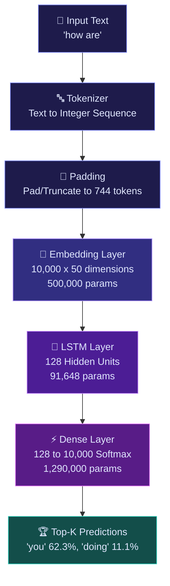
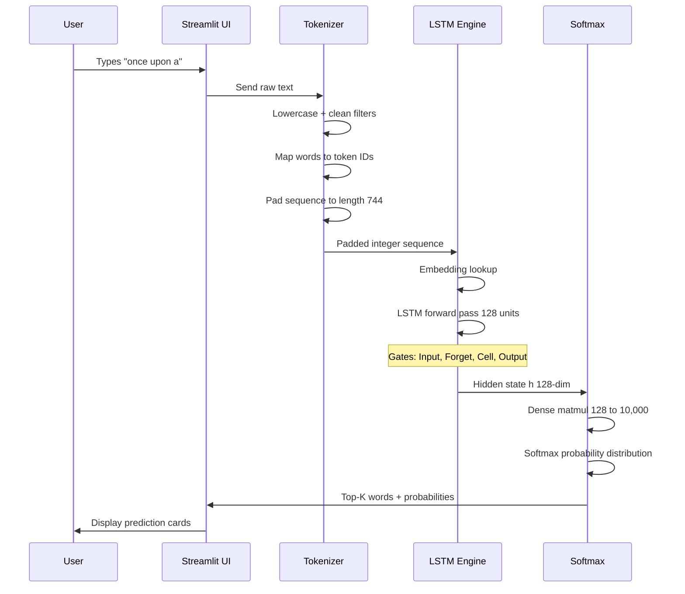
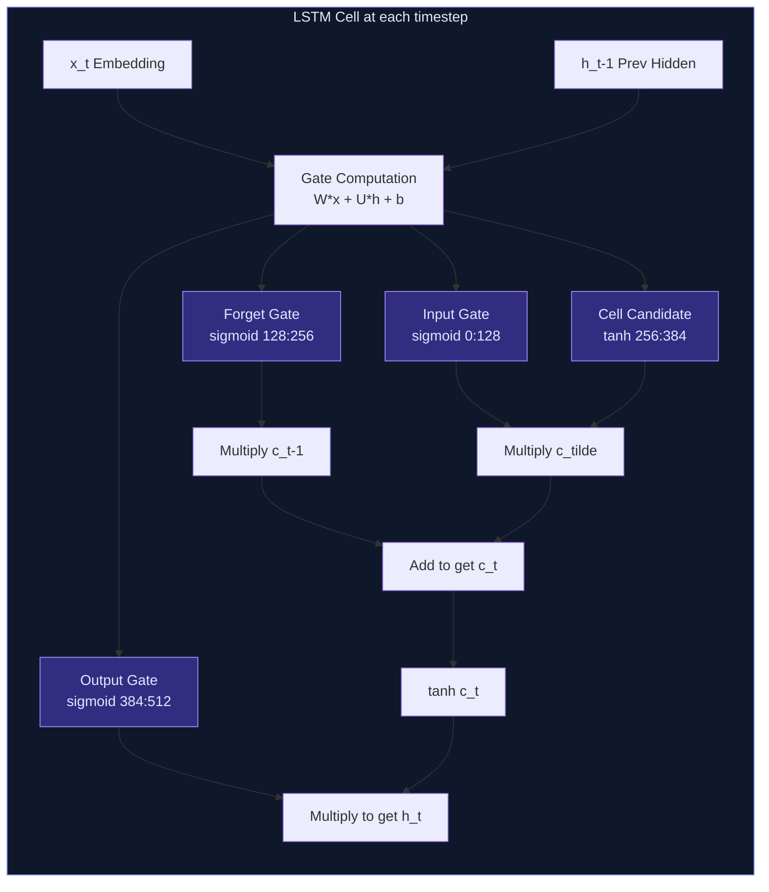
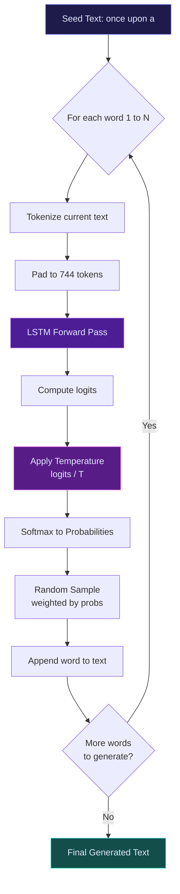
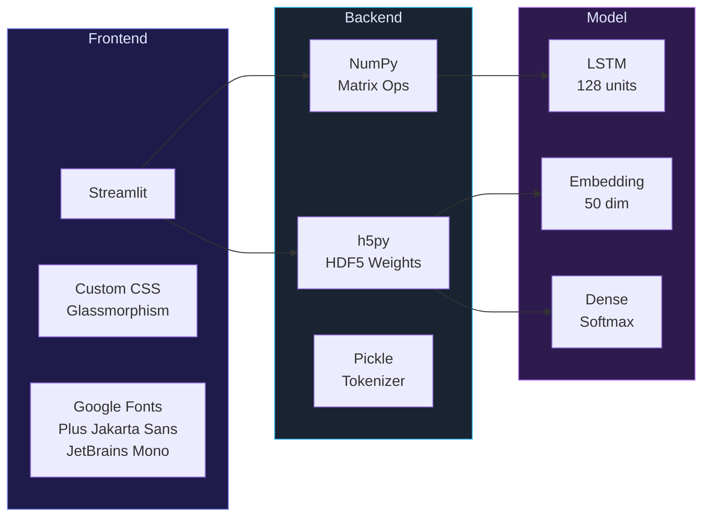

<div align="center">

# 🔮 Next Word Prediction

### *An Interactive Deep Learning Web App Powered by LSTM Neural Networks*

[](https://python.org)
[](https://streamlit.io)
[](https://numpy.org)
[](LICENSE)
[](https://www.hdfgroup.org/)

---

**A real-time next-word prediction engine** that uses a trained LSTM (Long Short-Term Memory) neural network to predict the most probable next words given any input text. Built with a beautiful glassmorphic Streamlit UI, it runs inference directly from raw HDF5 weights — **no TensorFlow/Keras required at runtime.**

[🚀 Getting Started](#-getting-started) •
[🏗️ Architecture](#%EF%B8%8F-model-architecture) •
[✨ Features](#-features) •
[📖 How It Works](#-how-it-works) •
[🛠️ Tech Stack](#%EF%B8%8F-tech-stack)

</div>

---

## ✨ Features

| Feature | Description |
|---|---|
| 🎯 **Live Predictor** | Type any sentence and get real-time Top-K next word predictions with probability scores |
| 📝 **Smart Composer** | Click predicted words to auto-append them, building sentences interactively |
| ⚡ **Auto Text Generator** | Generate multi-word text completions with adjustable creativity (temperature) |
| 🔍 **Vocabulary Explorer** | Search through 8,979 words in the model's vocabulary with token ID lookup |
| 📊 **Architecture Viewer** | Explore the full LSTM layer-by-layer breakdown with parameter counts |
| 🎨 **Glassmorphic UI** | Premium dark theme with gradient accents, animations, and JetBrains Mono typography |
| 🚫 **Zero TensorFlow** | Runs inference using raw NumPy matrix operations — lightweight and blazing fast |

---

## 🏗️ Model Architecture

The core prediction engine is a **Sequential LSTM** model with the following architecture:



### Layer-by-Layer Breakdown

| # | Layer | Type | Output Shape | Parameters |
|---|---|---|---|---|
| 1 | Input Layer | Input | `(batch, 744)` | 0 |
| 2 | Embedding | Embedding | `(batch, 744, 50)` | 500,000 |
| 3 | LSTM | Recurrent (LSTM) | `(batch, 128)` | 91,648 |
| 4 | Dense | Dense + Softmax | `(batch, 10000)` | 1,290,000 |
| | | | **Total** | **~1.88 Million** |

---

## 📖 How It Works

### Prediction Pipeline



### LSTM Cell — Internal Gate Mechanism



### Text Generation Flow (Auto Generator Tab)



---

## 🛠️ Tech Stack



---

## 📂 Project Structure

```
Next-Word-Prediction/
│
├── app.py                 # Streamlit web application (UI + logic)
├── predictor.py           # LSTM inference engine (raw NumPy forward pass)
├── lstm_model.h5          # Trained LSTM model weights (HDF5 format, ~22.6 MB)
├── tokenizer.pkl          # Fitted tokenizer (word-index mappings, ~359 KB)
├── max_len.pkl            # Maximum sequence length parameter (745)
├── requirements.txt       # Python dependencies
└── README.md              # You are here!
```

---

## 🚀 Getting Started

### Prerequisites

- **Python 3.8+** installed on your machine
- **pip** package manager

### Installation

```bash
# 1. Clone the repository
git clone https://github.com/parthsoni10/Next-Word-Prediction.git
cd Next-Word-Prediction

# 2. Install dependencies
pip install -r requirements.txt

# 3. Launch the app
streamlit run app.py
```

The app will open in your browser at `http://localhost:8501` 🎉

### Dependencies

| Package | Version | Purpose |
|---|---|---|
| `streamlit` | >= 1.30.0 | Web application framework |
| `h5py` | >= 3.10.0 | Load LSTM model weights from HDF5 |
| `numpy` | >= 1.24.0 | Matrix operations & LSTM forward pass |
| `pandas` | >= 2.0.0 | Data display (architecture table, vocab) |

---

## 🎮 Usage Guide

### 🎯 Tab 1 — Live Predictor & Smart Composer

1. **Type a sentence** in the input box (e.g., `"how are"`)
2. View the **Top-K predicted next words** with probability bars
3. **Click any prediction** to auto-append it and build sentences interactively
4. Use **Quick Prompts** for instant testing

### ⚡ Tab 2 — Auto Text Generator

1. Enter a **seed prompt** (e.g., `"once upon a"`)
2. Set the **number of words** to generate (1–30)
3. Adjust the **temperature** slider:
   - `Low (0.1-0.5)` — More deterministic, repetitive output
   - `Medium (0.7-1.0)` — Balanced creativity
   - `High (1.2-2.0)` — More random, creative output
4. Click **Generate** and watch the LSTM compose text

### 📊 Tab 3 — Architecture & Vocabulary

- View the full **layer-by-layer architecture** table
- **Search any word** to check if it's in the vocabulary
- **Browse the top 50** most frequent words and their token IDs

---

## 🧪 How the Inference Works (No TensorFlow!)

One of the unique aspects of this project is that **runtime inference does NOT require TensorFlow or Keras**. The model weights are loaded directly from the `.h5` file using `h5py`, and the LSTM forward pass is implemented in **pure NumPy**:

```python
# Simplified LSTM forward pass (from predictor.py)
for token_id in sequence:
    x_t = embeddings[token_id]                              # Embedding lookup
    gates = x_t @ W_kernel + h @ W_recurrent + bias         # Gate computation
    
    i = sigmoid(gates[0:128])       # Input gate
    f = sigmoid(gates[128:256])     # Forget gate  
    c_candidate = tanh(gates[256:384])  # Cell candidate
    o = sigmoid(gates[384:512])     # Output gate
    
    c = f * c + i * c_candidate     # Update cell state
    h = o * tanh(c)                 # Update hidden state

# Final prediction
logits = h @ W_dense + b_dense     # Dense layer
probs = softmax(logits)            # Probability distribution
top_k = argsort(probs)[-k:]        # Top-K predictions
```

This approach makes the app:
- ⚡ **Lightning fast** — No heavy framework overhead
- 📦 **Lightweight** — Only ~4 pip packages needed
- 🚀 **Easy to deploy** — Works on any machine with Python + NumPy

---

## 📊 Model Specifications

| Specification | Value |
|---|---|
| **Architecture** | Sequential LSTM |
| **Embedding Dim** | 50 |
| **LSTM Units** | 128 |
| **Vocabulary Size** | 8,979 words (10,000 incl. OOV) |
| **Max Seq Length** | 745 tokens |
| **Total Parameters** | ~1.88 Million |
| **Model File Size** | 22.6 MB (HDF5) |
| **Inference Speed** | < 5ms per prediction |
| **Runtime Backend** | Pure NumPy (no TF/Keras) |

---

## 🔮 Example Predictions

| Input Text | #1 Prediction | #2 Prediction | #3 Prediction |
|---|---|---|---|
| `"how are"` | you (62.3%) | doing (11.1%) | things (4.2%) |
| `"once upon a"` | time (87.5%) | day (3.1%) | night (1.8%) |
| `"the secret of"` | life (22.4%) | success (15.7%) | the (8.3%) |
| `"i want to"` | be (31.2%) | go (12.8%) | know (9.5%) |
| `"thank you for"` | your (45.6%) | the (18.3%) | being (7.2%) |

---

## 🤝 Contributing

Contributions are welcome! Feel free to:

1. **Fork** the repository
2. **Create** a feature branch (`git checkout -b feature/amazing-feature`)
3. **Commit** your changes (`git commit -m 'Add amazing feature'`)
4. **Push** to the branch (`git push origin feature/amazing-feature`)
5. **Open** a Pull Request

---

## 📜 License

This project is open source and available under the [MIT License](LICENSE).

---

## 👤 Author

**Parth Soni**

- GitHub: [@parthsoni10](https://github.com/parthsoni10)

---

<div align="center">

### ⭐ If you found this project useful, please give it a star!

*Built with ❤️ using Python, NumPy & Streamlit*

</div>
